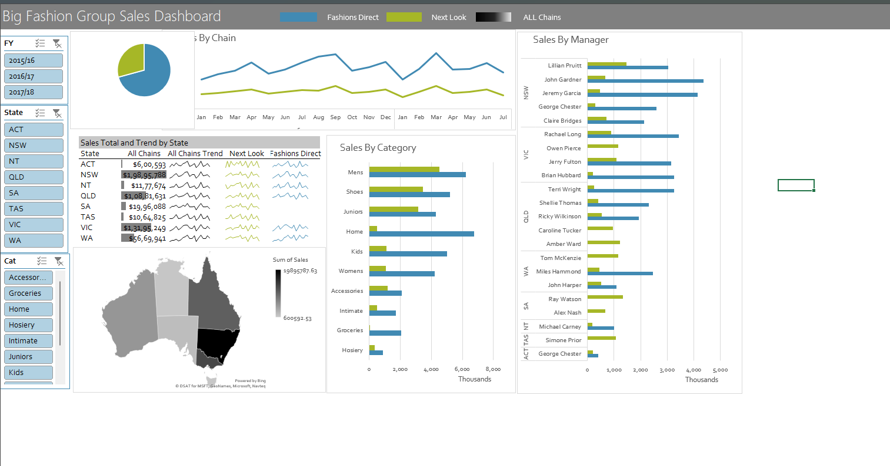

# Excel-Sales-Dashboard
# 📊 Big Fashion Group Sales Dashboard (Excel)

## 📌 Project Overview
This project is an interactive Excel-based sales dashboard designed to analyze and visualize sales performance across different states, categories, and managers.

The dashboard helps in tracking trends, comparing performance, and making data-driven decisions efficiently.

---

## 🎯 Key Insights Covered
- Sales distribution across different states (ACT, NSW, QLD, etc.)
- Monthly sales trends across multiple fashion chains
- Category-wise performance (Mens, Shoes, Kids, etc.)
- Manager-wise sales comparison
- Overall sales summary and performance tracking

---

## 🔧 Features
- Interactive filters (Year, State, Category)
- Dynamic charts and graphs for better visualization
- Sales trend analysis (monthly basis)
- Manager performance comparison
- State-wise sales mapping
- Clean and structured data representation

---

## 🛠 Tools & Technologies Used
- Microsoft Excel
- Pivot Tables
- Charts (Bar, Line, Pie)
- Data Filtering & Slicers
- Dashboard Design Techniques

---

## 📷 Dashboard Preview

---

## 💡 Key Skills Demonstrated
- Data Organization & Management  
- Data Visualization  
- Analytical Thinking  
- Attention to Detail  
- Report Creation & Documentation  

---

## 🚀 Purpose of the Project
To build a structured and interactive dashboard that helps in:
- Tracking sales performance  
- Identifying trends and patterns  
- Supporting business decision-making  

---

## 📁 Files Included
- `dashboard.xlsx` → Main Excel dashboard  
- `screenshot.png` → Dashboard preview  

---

## 📌 Conclusion
This project demonstrates the ability to manage, analyze, and present data in a structured and meaningful way using Excel.
